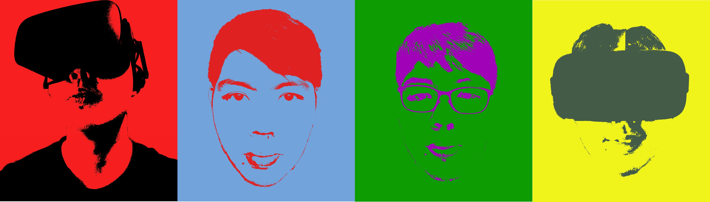

I am a business consultant in a banking software company, with experience in database management. My background in electrical engineering provided me with problem solving skills which eventually led to software. Nowadays, I get to interact with clients from different cultures which I use as an opportunity to share our newest technologies. I like to challenge myself to share technical information to business users as it allows me to improve on my professional development.

Recently I had purchased a online course on High Immersion Virtual Reality and an Oculus Rift which was a costly manoeuvre coming from a less-risky kind of guy like myself. 2 months later, it was worth it. I came up with a VR game that allows me to interact with virtual objects that I had personally created. I like to believe **grit** played an important role to what I was able to accomplish today. I realised my joy for VR, and every bit of it is fufilling to me.

Right now, I am working on my 3D modelling skills to use my passion for VR and build personalised experiences for people. I look forward to a job in the VR industry where my content creation can contribute value to the lives of everyday people.
