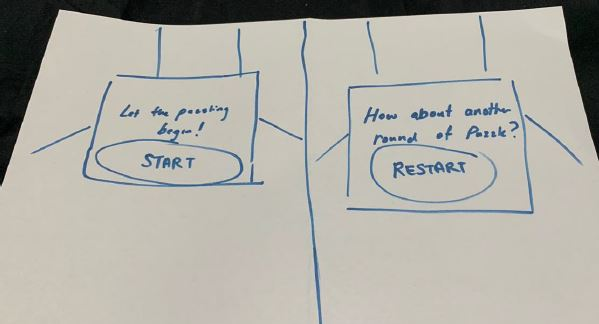
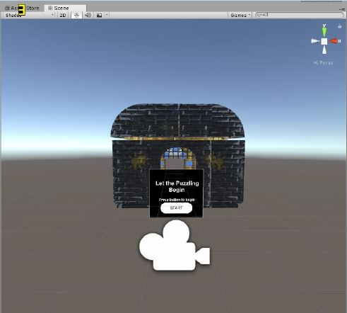
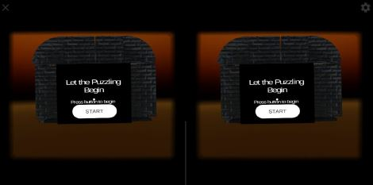
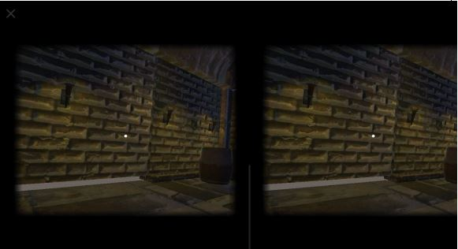
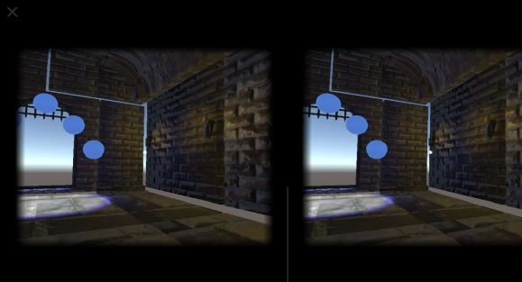
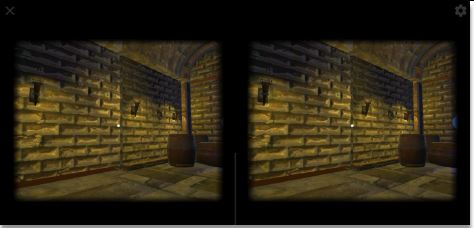
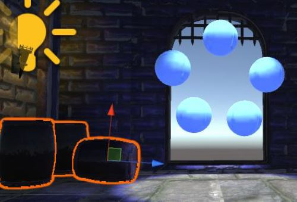
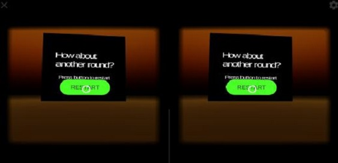
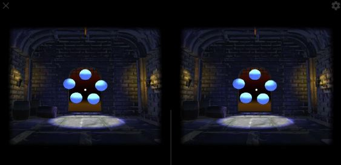

##Introduction  
This is a project that I have done with Udacity that provides me an opportunity to create a Virtual Reality Simon Says puzzle mobile application using Unity.

##Outcome
The game has been finalised after several rounds of iterations using feedback from different users.
Simon Says Puzzler is about following the sequence of the Orbs displayed in the dungeon. The user has to complete the Puzzle in order to escape the dungeon and will be given an option to play again at the end of the game.

##Story of the process 
Prior to development of the game, it is essential to identify the targeted audience. I have decided to target people who are new to VR. During the process, I have created a Persona for my audience as ‘group of people who are new to Virtual Reality (VR) and interested to experience VR.
This would mean that the environment should be comfortable and easy to experience. Which resulted in the mood setting of the scene, Mysterious. I should also avoid movement in the scene to reduce the chance of the user encountering simulation sickness, thus making the game more safe and enjoyable.
The sketches below, allowed me to reduce time spent on modifying my designs in unity.

####Sketches

Moving forward, I created a build from scratch; setting the scale and scene, defining a graphical user interface, adding audio and visual feedback. Testing it out with different users allowed me to gain insight with what could be improved in the game. Several iterations were made until the quality of the game was acceptable.

##User testing outcomes and iteration

<figure>
	<blockquote>
		
The skybox in the scene is too lively and draws the mood away from being mysterious.

		<footer>
			<cite>— User feedback#1</cite>
		</footer>
	</blockquote>
</figure>

####Iteration #1:
Setting a dark and more mysterious environment using a different skybox.

<figure>
	<blockquote>
		
Environment is too dark to see notice it is a dungeon. Torches are barely emitting light.

		<footer>
			<cite>— User feedback#2</cite>
		</footer>
	</blockquote>
</figure>

####Iteration #2:
Light emitted from the torches have been adjusted to have a greater intensity.

<figure>
	<blockquote>
		
Mood of the environment was eerie.

		<footer>
			<cite>— User feedback#3</cite>
		</footer>
	</blockquote>
</figure>

<figure>
	<blockquote>
		
Door is quite small. It looks like a window.

		<footer>
			<cite>— User feedback#4</cite>
		</footer>
	</blockquote>
</figure>

<figure>
	<blockquote>
		
The balls are too far apart and requires me to rotate my head too much. It would be better for them to be in circle

		<footer>
			<cite>— User feedback#5</cite>
		</footer>
	</blockquote>
</figure>

<figure>
	<blockquote>
		
The light emitted from the torches is brighter below than the top.

		<footer>
			<cite>— User feedback#6</cite>
		</footer>
	</blockquote>
</figure>

<figure>
	<blockquote>
		
It would be nice if the game could have its ‘RESTART’ button located right in the center of the screen. So when I complete the puzzle, I don’t have to move my head to reach the button.

		<footer>
			<cite>— User feedback#7</cite>
		</footer>
	</blockquote>
</figure>

<figure>
	<blockquote>
		
UI is a little big.

		<footer>
			<cite>— User feedback#8</cite>
		</footer>
	</blockquote>
</figure>

###The following iterations were performed;

  *  Decreased size of barrel to make the gate/doors look bigger.
  *  Re-arranged positions of the orbs to make it more comfortable for the user
  *  Raised position of Point Lights to match light emission from torches.
  *  Centered position of Restart UI to match Pointer when user completes the puzzle.

##Final

#Breakdown of final piece

  *  Set skybox to dark red to set mysterious mood
  *  Eerie background sounds to create more intense experience
  *  Used iTween's 'MoveTo' function to provide a more dynamic experience when user selects Restart
  *  Adjusted scaling to give a more realistic experience
  *  Adjusted positions of orbs and UI to provide a more convenient and comfortable experience to the user

#Conclusion
I found this project to be a good starting point for those who would like explore VR. It is easily accessible by anyone who owns a smartphone. In addition, Simon Says is easily known by many and the Simon Says Puzzler provides a familiar concept to the game. This game also allows the user to experience movement and interaction with other objects in Cardboard VR.
From the developer’s perspective, I have noticed many discrepancies while running the project in Unity on Desktop and Cardboard Mobile VR. Therefore as a best practice, the game should always be tested on mobile device as much as possible to achieve accurate results. This project has also stressed the importance of iteration through User Feedback which allows the quality of the game to be improved using different designs. 

The following includes the challenges that I have faced throughout the project and the solutions I came up with;

_**Using a Redmi 5 Plus (18:9 aspect ratio) results in the Left and Right image being too far apart and not merging in a 3D image once the headset is worn.**_
  - *Did another test using a different phone and resulted in correct 3D effect. Suspected that the app is stretching the view to fit 18:9 while at the same time breaking the effect.*
  - *Generated a custom QR Code for the Google CardBoard using https://vr.google.com/cardboard/viewerprofilegenerator/ and changing the advanced viewer parameters*
  - *Trial and error and found the best FOV values are*
	- Outer 33 degrees
	- Inner 33 degrees
	- Top 28 degrees
	- Bottom 31 degrees

---
_**User felt the environment was too small and the VR experience does not feel natural.**_
  - *Before development of any environment, it is important to first establish the scale. Re-scaling the environment after run-time is tedious and time consuming.*

---

##Video of my project:
`youtube: https://youtu.be/b7SdRmF2FP8`