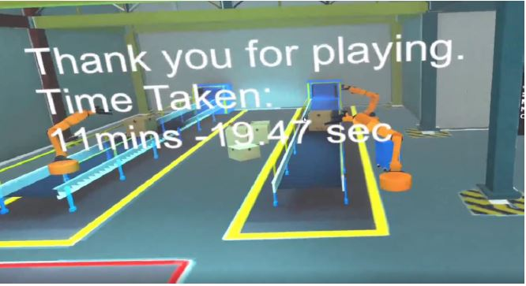

<!-- [Story of the process](#story-of-the-process)  
[Build Process](#build-process)  
[User testing outcomes and iteration](#user-testing-outcomes-and-iteration)  
[Breakdown of final piece](#breakdown-of-final-piece)  
[Conclusion](#conclusion)  
[Video](#video-of-my-project) -->
## Introduction
This is a project that I have done with Udacity that provides me the opportunity to create a Virtual Reality Rube
Goldberg Game using the software, Unity.

##Outcome
The game has been finalised after several rounds of iterations using feedback from different users.
The Rube Goldberg is to bring the ball into the goal position using different contraptions without it touching the ground.
The user is given a menu to create different objects that affect the gameplay through the use of Unity’s in-game physics.
There are a total of 4 different levels with each level requiring different objects to be spawned. At the end of the game,
the total time duration of the game will be displayed.

##Story of the process


In the Rube Goldberg Project, it is important to identify the contraptions that will be used in the development of the
game. Several sketches were made to identify the uniqueness of each object.

With the objects set, a couple of stages were created where the User had to create an object and use it to get the ball across the finish line.


The difficulty of every stage can be varied by limiting the number of objects that can be created.

The implementation of the contraptions was prioritised over the level as it would be easier to develop the stage when all the elements of the game are ready. These included scripting for acting forces on the ball when interacting with certain objects.


##Build Process
The SteamVR that was automatically launched from Unity does not work as intended. As a result, no visual output was displayed in my Head Mounted Display (HMD). Therefore, launching the project from Unity into my Oculus Rift required some tweaking (Close the SteamVR running in the background and manually launch the SteamVR before starting the game in Unity).

####Setting up controls


The game required new actions such as Spawning an Object,Displaying the Object Menu etc.. With the use of SteamVR input and key bindings, it was relatively easy to map action to key on my Oculus Touch. This also further enhances the compatibility with other VR Headsets which could be easily setup to play the game.

####Going in often


Accessing the HMD often allowed me to stabilise my code and provided many useful feedback such as adjusting the colliders of my objects and achieving an optimal position of my level board.


While testing I noticed that the user was able to grab and throw the ball into a desired location. This breaks the game and makes the challenge of the ball not touching the ground pointless. A simple fix was to prevent the ball from being thrown by removing the velocity while the ball is being released.


##User testing outcomes and iteration


Self-iterations of the game included creating a pedestal that makes it more convenient for the user to pick up the ball.

<figure>
	<blockquote>
		<p>It is difficult to see what items were available for spawning in the stage as the level board was placed in behind the camera.</p>
		<footer>
			<cite>— User feedback#1</cite>
		</footer>
	</blockquote>
</figure>

**Iteration#1**  
Re-position Level Board from the Curiosity Zone to a more prominent area.
***

<figure>
	<blockquote>
		<p>Swiping the touch controllers left and right scrolls the object menu too many times.</p>
		<footer>
			<cite>— User feedback#2</cite>
		</footer>
	</blockquote>
</figure>

**Iteration#2**
```csharp
if (!hasSwipedRight) {
    if (touchCurrent.x > 0.5) {
        SwipedRight();
        hasSwipedRight = true;
        hasSwipedLeft = false;
    }
}

if (touchCurrent.x == 0) {
    hasSwipedLeft = false;
    hasSwipedRight = false;
}
```
*Introduced Booleans (hasSwipedLeft and hasSwipedRight) to combat over-scrolling*

The checks above will only allow the User to scroll once and requires him or her to release the analogue stick back to its original position before making subsequent scroll.
***

<figure>
	<blockquote>
		<p>Spawned objects that were initially positioned on the ground required the user to bend down and move them. This creates a great deal of inconvenience.</p>
		<footer>
			<cite>— User feedback#3</cite>
		</footer>
	</blockquote>
</figure>

**Iteration#3**
```csharp
//Remove oldest object when maximum spawn count is reached
if (currentCount[currentObject] >= maxCount[currentObject]) {
    Destroy (GameObject.Find (string.Concat
        (objectPrefabList [currentObject].name, "(Clone)")));
    
    //Do not go below zero
    if (currentCount[currentObject] != 0) {
        currentCount [currentObject]--;
    }
    failAudio.Play(0);
}
```
*Adjusted code for spawning objects; By removing the oldest spawned object when spawning a new one will provide the User more convenience*

The User does not have to move the objects manually by grabbing them. But one can use the touch controllers to spawn a duplicated object in a new position while removing the old object. The conventional method, grabbing, is still available for those who prefer grabbing and moving an existing object.
***

##Breakdown of final piece
With the use of Steam Level Loader, There is a seamless transition between stages. The fade in and fade out effect provides a very professional experience.

An anti-cheat detection system was also created to determine if the user has used the contraptions to win the game. Several mechanisms were used to detect if the ball was grabbed after being released from the starting point. Thus, preventing the User from cheating mid-way.


#### <u> Anti-cheat mechanism </U>

  * make ball ungrabbable until it comes to a halt  
  * limit throwing velocity
  * create a starting structure and force player to use it
  * change colour of the ball to indicate cheating
  * disable interaction with goal


Upon detection, the ball will be coloured in red to display that an abnormality has been detected. And it will no longer be able to interact with the goal using Unity’s Layering System.


```csharp
public void AntiCheat() {    
    thisRend = GetComponent<Renderer> ();
    //change ball colour, set as inactive
    if ((FirstTest&&!SecondTest) || (FirstTest&&SecondTest)) 
    {
      //Make Goal's layer as Uninteractable
      goal.layer = 9;
      thisRend.material.SetColor ("_Color", Color.red);
    } 
    else
    {
      thisRend.material.SetColor ("_Color", Color.white);
    }
  }
```  
##Winning Scene

With the completion of all 4 stages, the User will be presented with a winning screen that displays the time taken from start to completion of the final stage. The song ‘We are the Champions’ will also be played while transporting the User to a position, overlooking the entire environment.



##Conclusion  
<!-- Provide a clearer description of the challenges encountered and how I have solved them. This section will help tell the reviewer your thought process on solving issues and is probably the most important. You want to present this as a bulleted set as it draws the reviewers eye in -->
I found the Rube Goldberg project to be a good demonstration of how Physics work in a VR environment. It provides an immersive experience for those who would like explore VR. The project was developed using SteamVR, which provides access to users who own either the Oculus Rift or the HTC Vive. This project also allows the User to be creative by solving challenges in his or her own way.
From the developer’s perspective, this project was a milestone for me. It provided me a huge opportunity to work on my design and technical skills. Creating an object menu to spawn objects, a cheat detection system, allowed me to advance my skills as a developer. This project also further enhances my knowledge on Unity’s Physics system. The following includes the challenges that I have faced throughout the project and the solutions I came up with;

_**Objects that were placed on ground required the User to bend down to grab and move them which creates a great deal of inconvenience**_
  - *Created a pedestal for the ball*  
  - *Changed the logic of how objects were spawned; when spawning a new object that has reached maximum count, the oldest object will be removed*

---
_**Player cheating by throwing the ball into the goal or grabbing the ball after it was released and manually moving it to a desired location**_
  - *Adjusted velocity style to no change when released from hand*  
  - *By using layer detection, the ball no longer interacts with the goal upon detection*

---
_**Certain stages were too difficult as they involved bouncing of the ball to reach the collectibles**_
  - *An option would be to make the collectibles bigger but this would make the game look _**sloppy**_ and _**inconsistent**_ with collectibles from other stages*  
  - *Added transformation information on top of the spawned object which results in more precise and accurate bounces*

---
_**Holding the analogue stick for too long would result in over-scrolling in the object menu making selection of a specific object difficult**_
  - *Added checks to combat over-scrolling which required the User to release the analogue stick back to its initial position before attempting a second scroll*  

---
_**Displaying the Object Menu hinders the User's view of his/her surroundings**_
  - *Created a method to display the object menu only when the user's finger touches the analogue stick*  

---
_**Resetting the level and collectibles when the ball touches the ground**_
  - *Created a list of initial positions of all collectibles*  
  - *When ball touches ground, destroy all remaining objects tagged as collectible*
  - *Respawn prefabs based on list.Count and positions*

---

##Video of my project:
`youtube: https://youtu.be/B3b08U2x34w`
