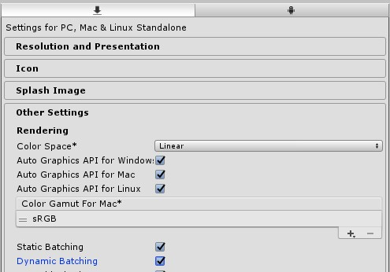
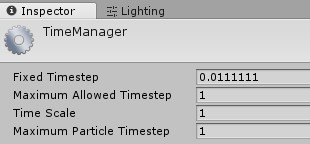
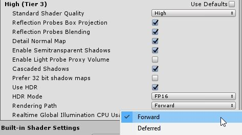
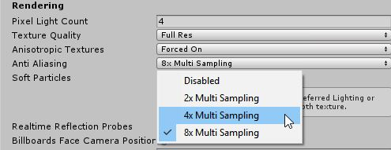
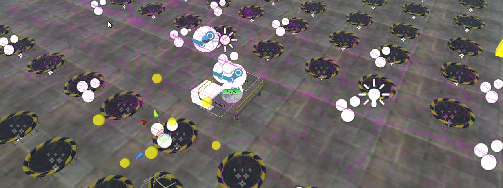
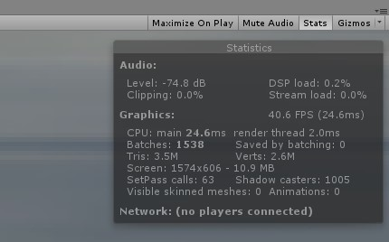
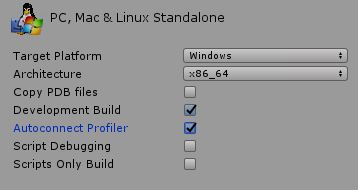
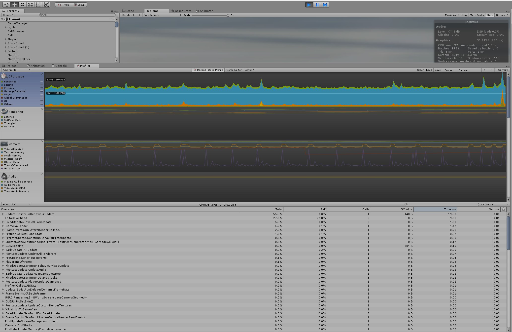
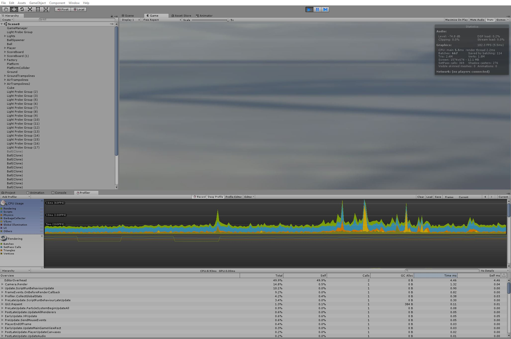

##Introduction
Performance optimisation is one of the most important skillsets for a VR developer, since apps running below the target framerate are essentially unplayable, causing nausea and discomfort. This project simulates a real-world scenario where a VR game has been hastily built with a focus on functionality rather than performance (a common approach while prototyping). By utilising my optimisation skills, I will make the game a performant app ready for release.

##Outcome
By the end of this project, I will have combined various skills and ideas that I have been practising throughout the course (High Immersion Virtual Reality); 
  *  Using static and dynamic batching
  *  Optimising physics
  *  Creating object pools
  *  Caching variables and optimising code
  *  Setting up lighting with MSAA
  *  Baking lighting
  *  Using light probes
  *  Using the profiler for performance optimisation

 ##Story of the process
<!--Include GIF of unoptimised gameplay-->
For this project, I will be optimising the performance of this VR game in which I am bounce balls on as many trampolines as possible. The integrity of the gameplay must be preserved and the following parts of the game must not change;

  *  trampolines cannot be removed, and must retain their ability to score a point and show particles when a ball hits them  
  *  the lights in the scene cannot be removed and must show up in either baked or realtime
  *  a ball must spawn every 0.5 seconds
  *  there must be a score visible to the player from their starting position
  *  there must be a countdown timer visible to the player
  *  the player must be able to pick up and throw balls at the trampolines

##Build Process

### <u>Integrity of gameplay must be maintained</u>  

  *  no trampolines or lights removed
  *  balls spawn every 0.5 seconds
  *  picking up and throwing ball at trampoline increases score
  *  score is visible from starting area


### <u>Turn on Dynamic and Static Batching</u>  
Batching is important to reduce the number of drawcalls. By enabling dynamic batching, small meshes in the project will have their vertices combined and drawn at one go.
Static batching combines static (not moving) GameObjects into big Meshes, and renders them in a faster way.



  *  turn on the dynamic and static batching options which can be found in the Player settings
  *  ensure that any object that doesn't move is checked as static


### <u>Physics Update Rate to target framerate</u>  
  *  find your timestep 
$$
Fixed Timestep = \dfrac{1}{Targeted Framerate}
$$
  *  this setting can be found in Edit > Project Settings > Time. And adjust Fixed Timestep to the calculated value (90fps -> 0.01111)



By adjusting fixed timestep to **0.011111**, we are targetting the physics update rate of the game to be 90fps which matches the targeted framerate of Desktop VR games. Ensuring that the physics update rate is the same as the targeted FPS prevents judders. 

For example, the game might be running at 75fps, so looking around is completely smooth, but if your OVRCameraRig is locked to the position of some physics object, and that's only being updated 50 times per second, then your OVRCameraRig is often going to spend two frames in the same position, because the physics hasn't been updated in between.

### <u>Moving objects with colliders all have rigidbodies</u>  
 A huge performance compensation is required for movement of static colliders because the physics assume that they will never move and so have specific optimisations applied to them by the physics engine.
 If these colliders move during runtime, the assumptions made by the physics engine have to be recalulated, causing a large performance hit.
  *  moving objects are not marked as Static.
  *  rigidbodies are included for moving objects with colliders
  *  remove unnecessary rigidbodies from non-moving objects

### <u>Use a Object Pooler in your project</u>  
The aim of **Object Pooling** is to replace the conventional Instantiate and Destroy with reusability.

1. Allocate memory for caching,   

| Variable      	|  	  |   	| Reference                                         	|
|:-------------	  |---	|---	|:---------	                                          |
| pooledBullet  	| -  	|   	| prefab in the object pool                         	|
| bulletsAmount 	| -	  |   	| number of objects you want to the object pool     	|
| pooledBullets 	| - 	|   	| the object pool itself                            	|
| bulletPoolNum 	| -	  |   	| a number used to cycle through the pooled objects 	|


```csharp
public static ObjectPool current;
//Ball Variables
public GameObject pooledBall;
public int ballsAmount = 12; 
public List<GameObject> pooledBalls;
public static int ballPoolNum;
```
2. Create a object pool where you set the maximum number of objects you would have in your game (ballsAmount).

*The snippet below creates a list of balls and disables them.*
```csharp
void Start() {
  //Create Balls Pool
  pooledBalls = new List<GameObject>();

  for (int i=0 ; i<ballsAmount ; i++) {
    GameObject obj = Instantiate(pooledBall);
    obj.SetActive(false);
    pooledBalls.Add(obj);
  }
}
```

3. Create a function that can be called from anywhere which is used to *retrieve the ball from the pool*.

```csharp
public GameObject GetPooledBall {
  ballPooledNum++;
  if (ballPoolNum > ballsAmount - 1)) {
    ballPoolNum = 0;
  }
  
  //If we've run out of objects in the pool too quickly,
  //create a new one
  if (pooledBalls[ballPoolNum].activeInHierarchy) {
    //create new ball and add it to the ballList
    GameObject obj = Instantiate(pooledBall);
    pooledBall.Add(obj);
    ballsAmount++;
    ballPooledNum = ballsAmount - 1;
  }
  return pooledBalls[ballPoolNum];
}
```

4. Lastly, call the function
```csharp
void SpawnBall() {
  //Run the Objet Pool's retriever function
  //and create a reference to the returned object
  ballReference = ObjectPool.current.GetPooledBall();
  //Do something with the ball
  ...
}

### <u>Code caching</u>  
A good practice is to store variables/references when there is a change, rather than creating/updating them every frame.

```csharp
void Update() {
  if(numCollected != previousCollected) {
    text.text = "Score: " + numCollected.ToString();
    previousCollected = numCollected;
  }
}
```

### <u>Optimising Lighting</u>
For this game I have used [Forward lighting](https://docs.unity3d.com/Manual/RenderTech-ForwardRendering.html) for VR as it supports MSAA.

  *  Change Rendering Path by Edit -> Project Settings -> Graphics



  *  Enable Anti Aliasing 4x or 8x MSAA by Edit > Project Settings > Quality



### <u>Light Probes</u>  
The game's moving objects need lighting, but realtime lights are expensive. By using light probes we can precompute information at a specific point and interpolate lightings between those points.
As a result, we can simulate real-time lighting at a fraction of the cost instead of *true* real-time lights.

Here are some of the techniques I have used to reduce realtime performance,



  *  lit the entire scene within view of the player with light probes
  *  probes are set up so there are no serious artifacts or light popping
  *  avoid places where dynamic objects will never reach

To further reduce realtime performance cost, we could use Baked Lighting. But that will be covered another time.

###<u>Using the deep profiler</u>  
The general statistics shown below should be avoided as it provides stats only for the 2D view in Unity and **not** HMD.



To perform deep profiling, 
1. Go to File > Build Settings

2. Check Development Build and Autoconnect Profiler





#Conclusion
Using the techniques mentioned above, I increased the overall performance by at least 100%. The main challenge was to identify the bottleneck using the deep profiler. 
  *  when doing a deep profile, view using the HMD in **all directions**
  *  disable GameObjects can help to narrow down and locate which are causing performance issues
  *  take note of the total number of drawcalls and tris in each room (optimally 1-2 million max tris/verts on DesktopVR)
  *  use Frame Debugger for a more accurate measure of performance


##Video of my project (pre-optimisation):
`youtube: https://youtu.be/rV8dWkIYfac`

##Video of my project (post-optimisation):
`youtube: https://youtu.be/-s2QOcXwNhw`

Further enhancements to the game:  
  *  Add a timer and a target number of points for players. For example, can players get 20 points in 1 minute?
 *  Add some sounds to make the experience more enjoyable.
 *  Customize the particle effects that appear when players score points.
 *  Create a button that resets the score.
 *  Add a "score multiplier" that floats in the scene somewhere. When hit with a ball, it disappears all points scored within a short time are multiplied.
