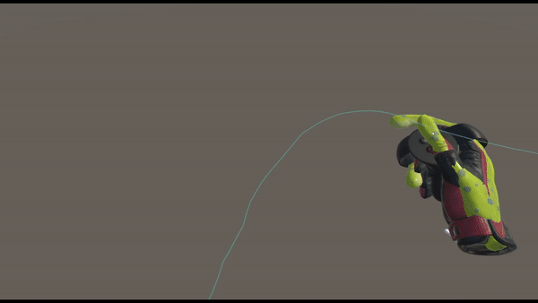
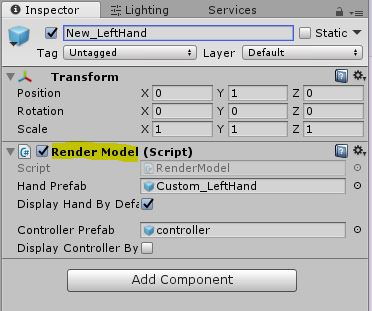
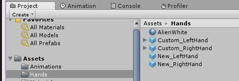
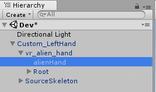
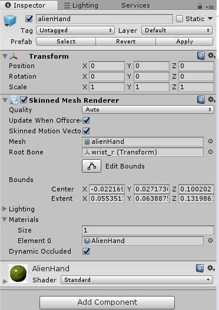
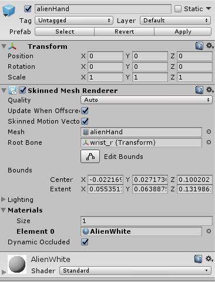
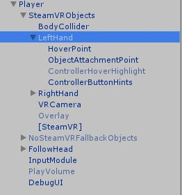

##Introduction
In Virtual Reality (VR), hand models and poses go hand in hand (no pun intended). For extra immersion, many games in the world use different hand models and poses when player interact with objects. SteamVR Skeleton Poser System  makes this entire process is actually easy and takes 5 minutes to get it up and running.

###Here's what we are going to make

####Let's get started

1. Download and install SteamVR into Unity using [this link](https://assetstore.unity.com/packages/tools/integration/steamvr-plugin-32647).  
**Note: When upgrading from an older version, it is best to first delete the SteamVR folder in your project, and then import the package**

2. Create two GameObject prefabs (left and right hand) and add the script, **RenderModel**, that should be included in the SteamVR integration package. Alternatively, you can copy both hand prefabs from *SteamVR/InteractionSystem/Core/Prefabs* .  
And rename them to **New_LeftHand** and **New_RightHand**.

3. Have a copy of the hand models you want to use from SteamVR/Prefabs or one that you have in mind and place them in a convenient location (*asset/hands*).  
For example, I prefer Alien hands and used the default ones provided by SteamVR/Prefabs (vr\_hand\_alien\_left), and placed them in the *asset/hands* folder and renamed them to **Custom_LeftHand** and **Custom_RightHand**. 

4. Locate the material within the **SkinnedMeshRenderer** on the prefabs you have created in the previous step (Custom\_LeftHand and Custom\_RightHand). 
You can easily find this by creating one in the scene and then expanding 'Custom_LeftHand'.

This material needs to be replaced by the material included in the your desired model. For me, it's 'AlienWhite'.

####My New Shader

5. With your new material set, replace public Hand Prefab field on your left and right RenderModel prefabs that you have created in step 2 (*_new_Lhand and Rhand) with the prefabs that have created in step 4 (New\_LeftHand and New\_RightHand).

####Before
.jpg "Existing HandPrefab")
####After
.jpg "New HandPrefab")

Remember to do the same for New_RightHand.

6. Lastly, replace the prefab located in Render Model Prefab public field of the Left and Right GameObject hands' Hand script under the SteamVR Player GameObject using the prefabs you have created (**New_LeftHand** and **New_RightHand**)

####Before
.jpg "Current Render Model Prefab")
####After
.jpg "Replaced Render Model Prefab")

Thats it. You should be able to see your own hand model. 

Next we will take a dive in looking at how we can create our own hand poses in this [article](https://olivrcheok.com/Custom%20Hands%20Part%202)/).
