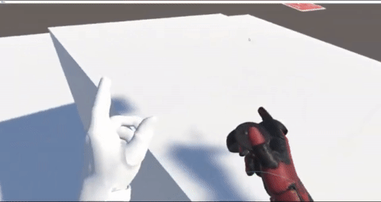
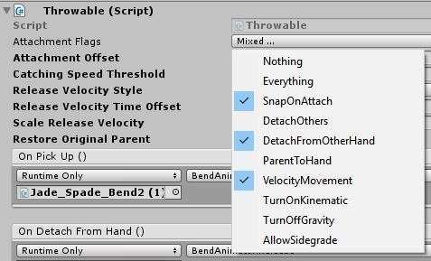
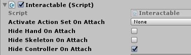
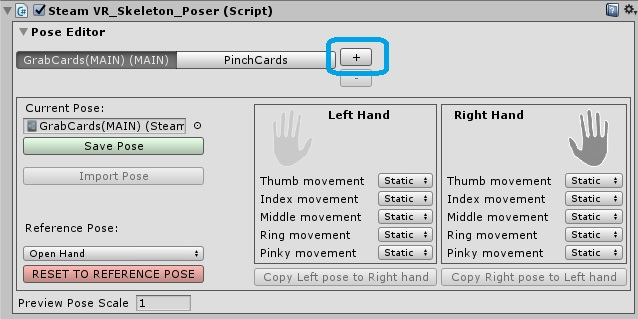
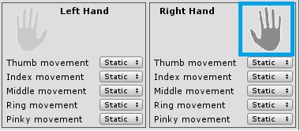
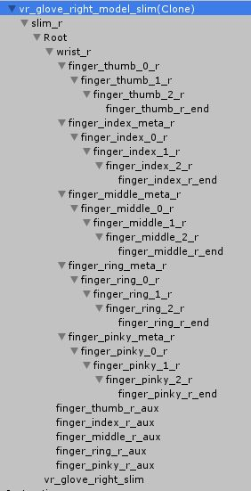
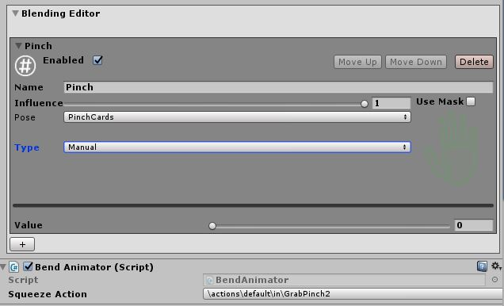

##Introduction
This is part 2 of creating custom hand models and poses

###Here's what we are going to make

####Let's get started

In this tutorial, we will creating a new hand pose for interacting with a poker card.
You may use any gameobject that you would like to have a desired pose when interacting

1.	Download and install SteamVR into Unity using [this link](https://assetstore.unity.com/packages/tools/integration/steamvr-plugin-32647).  
**Note: When upgrading from an older version, it is best to first delete the SteamVR folder in your project, and then import the package**

2.	On the gameobject, add a Rigidbody, Interactable script and Throwable script. These scripts are from SteamVR and should be already imported in the previous step.

3.	Assign the following attachment flags under Throwable,

4.	Uncheck **Hide Hand on Attach** so we can see our pose.

5.	Check **Hide Controller on Attach** so that we have unobstructed vision on our hands or pose.

6.	Add SteamVR Skeleton Poser script,

7.	Add a new pose by clicking on the + sign,

8.	Select either a left or right hand to create a pose. For me, I prefer using a right hand as that is my dominant hand.

9.	Notice that after you add the Steam_VR Skeleton Poser script, we can now expand the object on the hierarchy to see each bone in our fingers.
Tip: Alt + left click to expand all finger bones in hand model.

10.	From here, we can perform a rotation on each bone to your desired pose.

11.	After you have achieved your desired pose. Remember to mirror it to the opposite hand by selecting **Copy Right pose to Left Hand** and save the pose.

###Finish
All Done. You should now be able to see the pose when you interact with the given object.

##Additional Information
The rest of the article will talk about the Pose and Blend Editor. These additional parameters provide additive animations to the pose.

####Pose Editor:
  * Free - Do not want pose to apply to a specific finger (it will only listen to the skeletal system)
  * Extend – The current pose of the finger will be the minimum grip and only be extended outwards
  * Contract - Opposite of extend
 
####Blend Editor:
The following are actions that are used to influence a secondary behaviour on top of the existing pose,
  * Manual – provides an influence value that can be controlled by a script
  * Analog – Analog actions that are mapped to the controller.
  * Boolean – Boolean actions that are mapped to the controller ; Smoothing speed value should be from 10 – 30.

####Mask:
Green parts will have the blending behaviour applied to them.

####Example:
Here is a Poker Card with a secondary pose, PinchCards, that I have blended using a manual action (GrabPinch2).

  

