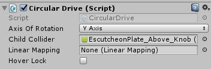

###Here's what we are going to make

####Let's get started

1. Download and install SteamVR into Unity using [this link](https://assetstore.unity.com/packages/tools/integration/steamvr-plugin-32647).  
**Note: When upgrading from an older version, it is best to first delete the SteamVR folder in your project, and then import the package**

2. The door asset that I will be using in this tutorial can be download from [here](https://opengameart.org/content/wooden-squared-door).
**Alternatively, you can use any door to implement the same functionality.**

3. Due to the art model not being imported correctly, we need to make adjustments to re-align the door and its frame.
First, create the door from the Prefab and place one in the scene.

To perform the realignment, break the prefab by moving HingesWings_Movable out of the WoodenSquaredDoor prefab. So that your scene hierarchy looks like the one below,

4. Create a empty gameobject and align it to the door's hinges (pivot point). Now make the gameobject the parent of HingesWing_Movable.  
  **Note: My empty gameobject is 'Door'.**

In addition, you can test if the pivot point works by rotating it as seen below,

5. On the door knob (\*\_Above_Knob), add a Circular Drive script that is provided by SteamVR.

Change the Axis of Rotation to Y as we want to rotate the handle up and down. Also limit the rotation the handle by setting a minimum rotation of 0&deg and a max rotation of 45&deg.

6. Create a mesh collider for the door handle and add it to the Circular Drive as the child collider so we can interact with it.

Lets test it!

7. Now that our door handle works. We need to open the door after the handle is pressed down. Select '\*\_Plate_Above' and create a Sphere Collider (The Radius is up to your preference) so the user can easily open the door by pushing the handle.

8. Create another circular drive for the main door by adding it to the empty gameobject (Door). Also add the sphere collider as the child collider and limit the rotation of the door by 0&deg - 90&deg.

9. Now we have to make apply the phyiscs of how a door handle works. We can do this by initial disabling the Sphere Collider and only enable once the handle is rotated. Therefore, the door can only be opened after the handle is pushed down. To do this:
    * Disable the Sphere Collider
    * Under max angle of the Circular Drive script (attached to Knob), we can add a function at runtime to enable the Sphere Collider whenever the max rotation is reached.
    

  * Likewise, we can disable the mesh collider of the handle whenever the door is open (handle at 45&deg). Therefore the door has to be closed before the handle can return to its initial position.  

  * Lastly, remember to enable the mesh collider whenever the door reaches back its initial position (0&deg) so the user can open the door again.

###All done
Notice that we are only able to open the door when the handle has its reached its maximum rotation of 45&deg. And in order to bring back the handle to its initial position (0&deg), we need to close the door.

Credits to Unity3d College